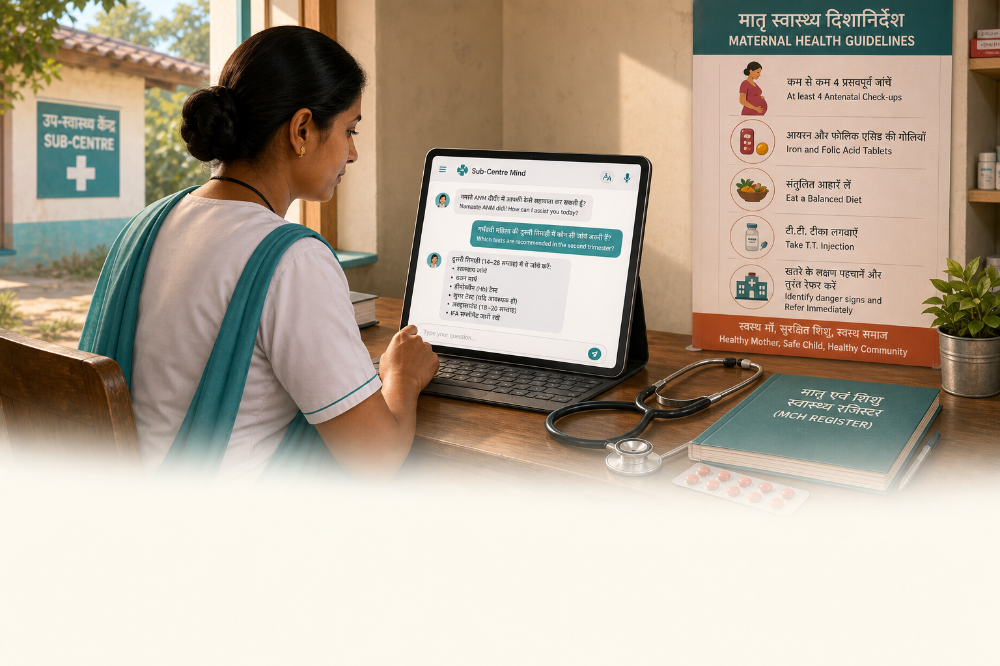

# Sub-Centre Mind

**Local-first clinical decision support for India's ANMs. The brain never leaves the room.**

[](https://www.kaggle.com/competitions/gemma-4-good)
[-FF6F00?logo=ollama&logoColor=white)](https://ollama.com/)
[](https://www.python.org/)
[](tests/)
[](LICENSE)
[](boundary_card.json)

---

**Why it matters.** India has roughly **170,000 Sub-Centres** (now being upgraded to Ayushman Arogya Mandirs), each serving 3,000–5,000 patients and staffed by at least one ANM (Auxiliary Nurse Midwife) — often the sole qualified health worker at the facility. She has no doctor within reach, a stack of paper registers to fill, and protocols that span hundreds of pages of MoHFW (Ministry of Health and Family Welfare) guidelines. When she's unsure — about an IFA (Iron and Folic Acid) dose, a danger sign, a refusal boundary — there is no one to ask. With the ongoing AAM (Ayushman Arogya Mandir) transformation expanding ANM responsibilities to NCD (Non-Communicable Disease) screening, the need for protocol-grounded decision support is growing, not shrinking.

**What we built.** A local-first clinical co-pilot that runs entirely on the ANM's own device. It answers safe protocol questions (IFA dosing, ANC (Antenatal Care) schedules, immunization), refuses diagnostic overreach with a deterministic, machine-readable contract, sends closed-loop nudges for IFA compliance, and drafts supervisor reports from an audit trail — all without a single byte of PHI (Protected Health Information) leaving the sub-centre.

**The differentiator.** The [Decision Boundary Card](#-decision-boundary-card) — a machine-readable specification of exactly what the model answers, refuses, and escalates. Not a vague "it will be safe" claim; a versioned contract with 16 answerable entries and 16 refusal triggers, verifiable in 5 minutes.

---

> ### 🏆 Gemma 4 Good Hackathon — Health & Sciences Track
>
> **For judges — three fastest paths in:**
>
> | Path | What you'll see | Time |
> |------|-----------------|------|
> | 🔍 **Primary artifact** | [`boundary_card.json`](boundary_card.json) — 16 answerable + 16 refusals | 2 min |
> | ✅ **Gate 1 evidence** | Run `bash scripts/g1_checks.sh` (requires Ollama + gemma4:latest) | 5 min |
> | 🖥️ **Live demo** | `bash scripts/warmup.sh && bash scripts/run_app.sh` → [http://127.0.0.1:8501](http://127.0.0.1:8501) | 3 min |
>
> **TL;DR:** All 4 Gate 1 criteria pass. 60 tests. Multilingual (Hindi/Marathi/English). Voice input. 4-tab Streamlit demo. Zero cloud inference — Gemma 4 E4B via Ollama only.

---

## Contents

- [The Problem](#the-problem)
- [What We Built](#what-we-built)
- [Gate 1 Status](#-gate-1-status)
- [Decision Boundary Card](#-decision-boundary-card)
- [Architecture](#architecture)
- [Demo UI — Four Tabs](#demo-ui--four-tabs)
- [Quick Start](#quick-start)
- [Test Suite](#test-suite)
- [Engineering Quality](#engineering-quality)
- [Project Structure](#project-structure)
- [Prior Art & Differentiation](#prior-art--differentiation)
- [What We Refuse to Claim](#what-we-refuse-to-claim)
- [Hard Constraints](#hard-constraints)
- [Roadmap](#roadmap)
- [Engineering Lineage](#engineering-lineage)
- [Acknowledgments](#acknowledgments)
- [Glossary](#glossary)
- [License](#license)

---

## The Problem

India's Auxiliary Nurse Midwife (ANM) is the frontline of maternal and child health for 3,000–5,000 patients per sub-centre. She faces three compounding gaps:

| Gap | Reality |
|-----|---------|
| **Clinical isolation** | No doctor within reach for protocol questions — internet may be unreliable or absent |
| **Diagnostic overreach risk** | Pressure to answer questions beyond her scope (blood pressure interpretation, insulin dosing, bleeding assessment) creates liability |
| **Administrative burden** | Mandatory HMIS (Health Management Information System) / RCH-1 (Reproductive and Child Health) monthly reports must be hand-drafted from paper registers |

Previous tools either require connectivity, expose PHI to the cloud, or add data-entry burden. Sub-Centre Mind does none of those things.

---

## What We Built

A **local-first, offline-capable** clinical decision support system with five interlocking components:

| Component | What it does |
|-----------|-------------|
| **RAG (Retrieval-Augmented Generation) Engine** | Hybrid FAISS + BM25 retrieval over 11 MoHFW/WHO guideline PDFs. Confidence gate: similarity ≥ 0.7 or no generation |
| **Refusal Contract** | Deterministic tool-calling via Gemma 4's `/api/chat` function API — `refuse_and_escalate` fires for all diagnostic/prescriptive queries |
| **Multilingual ASR (Automatic Speech Recognition)** | Local Whisper (faster-whisper) with Hindi/Urdu disambiguation, phonetic normalisation for medical loan-words |
| **Nudge Engine** | Closed-loop state machine (SCHEDULED → SENT → CONFIRMED / ESCALATED), persisted locally |
| **Audit → Report** | Append-only JSONL audit trail → aggregate stats → downloadable draft supervisor summary |

---

## ✅ Gate 1 Status

Gate 1 deadline: **May 5, 2026, 18:00 CET** — all four criteria verified.

| Criterion | Result | Evidence |
|-----------|--------|---------|
| 1. Tool calling returns valid `refuse_and_escalate` JSON | **PASS** | BP 160/110 → `urgency: critical`, valid function args |
| 2. 5/5 refusals trigger correctly | **PASS** | TB cough, insulin, bleeding, metformin, rash — all fire `refuse_and_escalate` |
| 3. Multilingual RAG >0.7 similarity | **PASS** | Hindi: 0.782 · Marathi: 0.761 |
| 4. Latency ≤12s per query (warm) | **PASS** | 3.3s end-to-end after `scripts/warmup.sh` |

Run yourself:
```bash
bash scripts/g1_checks.sh   # automated checks 1 + 2
```
Checks 3 and 4 require the FAISS index (`data/index/`) and a warm Ollama instance.

---

## 🗂 Decision Boundary Card

[`boundary_card.json`](boundary_card.json) is the primary hackathon artifact — a machine-readable specification of the model's refusal contract.

**v0.1 — verified May 3, 2026**

| Category | Count | Examples |
|----------|-------|---------|
| **Answerable** (protocol-only) | **16** | IFA dose, ANC schedule, TT injection, calcium supplementation, infant immunization |
| **Refusals** (diagnostic / prescriptive) | **16** | BP interpretation, insulin dosing, bleeding assessment, eclampsia, antibiotic prescription |
| **Vision use cases** (bounded) | 3 | Printed protocol OCR, medicine packet (always escalates), register row draft |
| **Vision refusals** | 2 | Diagnostic images (rash, ECG, ultrasound), patient photos |

All refusal entries include: `reason`, `urgency` (low / medium / high / critical), `escalation_target`, and `escalation_message`.

---

## Architecture

```
┌──────────────────────────────────────────────────────────────────┐
│                         ANM (User)                               │
│           Text · Voice (Whisper local) · Image (Gemma Vision)    │
└───────────────────────────┬──────────────────────────────────────┘
                            │
                            ▼
               ┌────────────────────────┐
               │      Query Router      │
               │  normalise → expand →  │
               │  retrieve (FAISS+BM25) │
               │  confidence gate ≥0.7  │
               └────────────┬───────────┘
                            │
             ┌──────────────┴──────────────┐
             │                             │
             ▼                             ▼
  ┌─────────────────────┐      ┌──────────────────────┐
  │   Gemma 4 E4B       │      │   Refusal Handler     │
  │   (Ollama local)    │      │   refuse_and_escalate │
  │   /api/chat tools   │      │   → named MO          │
  └──────────┬──────────┘      └──────────────────────┘
             │
    ┌────────┴─────────┐
    │                  │
    ▼                  ▼
┌─────────┐   ┌──────────────────┐
│  Answer │   │  Nudge Engine    │
│  + cite │   │  state machine   │
└─────────┘   │  → audit JSONL   │
              └──────────────────┘
```

**Key design decisions:**

- **Local-only inference** — Gemma 4 E4B via Ollama. No Bedrock, no OpenAI, no Claude in the inference path.
- **Confidence gate before generation** — if top retrieval similarity < 0.7, Ollama is never called. Prevents hallucination on weak evidence.
- **ASR normalisation pipeline** — Whisper phonetic mis-transcriptions (e.g. `कल्शीम` → `calcium`) are normalised before FAISS embedding. Hindi/Urdu disambiguation with auto-retry.
- **PHI never leaves the device** — audit log is local JSONL; nudge state is local JSON; no cloud write path exists.

---

## Demo UI — Four Tabs

Launch: `bash scripts/warmup.sh && bash scripts/run_app.sh` → [http://127.0.0.1:8501](http://127.0.0.1:8501)

| Tab | What it demonstrates |
|-----|---------------------|
| **💬 Ask** | Protocol Q&A with hybrid retrieval, confidence gate, multilingual voice input (Hindi default, Marathi/English/Auto), optional tool-calling round-trip with `refuse_and_escalate` |
| **📷 Photo** | Gemma 4 vision on 3 bounded use cases: printed protocol OCR → RAG follow-up, medicine packet (always ends with "Decision required from Medical Officer"), ANC register row → draft fields |
| **🔔 Nudges** | Closed-loop follow-up state machine — create nudges, advance through SCHEDULED → SENT → CONFIRMED / ESCALATED, view history |
| **📋 Report** | Audit JSONL → headline stats → downloadable template draft → optional Gemma narrative summary |

---

## Quick Start

### Prerequisites

```bash
# Python 3.10+, pip, git
ollama pull gemma4:latest          # ~9.6 GB — do this first
```

### Install

```bash
git clone https://github.com/prasadt1/sub-centre-mind.git
cd sub-centre-mind
python -m venv .venv && source .venv/bin/activate
pip install -r requirements.txt
```

### Verify model

```bash
ollama run gemma4:latest "IFA tablet dose for pregnant women per MoHFW?"
# Expected: 180 tablets, 1 daily for 180 days post-conception
```

### Build the index (one-time)

```bash
python src/rag/ingest.py            # indexes data/health-corpus/ → data/index/
```

> The MoHFW/WHO PDFs are included in `data/health-corpus/`. Ingestion takes ~2 min on CPU.

### Run the demo

```bash
bash scripts/warmup.sh              # pre-loads Gemma 4 (avoids 16s cold-start)
bash scripts/run_app.sh             # opens http://127.0.0.1:8501
```

### Gate 1 checks

```bash
bash scripts/g1_checks.sh           # automated tool-calling + refusal verification
```

### Smoke test RAG

```bash
# Hindi query
python scripts/rag_smoke.py "गर्भवती महिलाओं के लिए IFA खुराक क्या है?"

# Marathi query  
python scripts/rag_smoke.py "गर्भवती महिलांसाठी IFA डोस काय आहे?"
```

---

## Test Suite

```bash
pytest tests/ -q
# 60 passed, 1 skipped
```

| Test file | Covers |
|-----------|--------|
| `test_gate.py` | Confidence gate logic |
| `test_lang.py` | Language detection, ASR normalisation, query expansion, Arabic-script detection |
| `test_generate_integration.py` | RAG generation with gate, normalisation in the `generate_answer` path |
| `test_nudges.py` | State machine transitions (happy path + escalation) |
| `test_store.py` | Nudge JSON persistence (serialize / deserialize / atomic write) |
| `test_dispatcher.py` | Dispatcher protocol conformance |
| `test_report.py` | Audit aggregation + template summary |
| `test_vision.py` | Vision client (prompt selection, boundary note, error handling) |
| `test_voice.py` | ASR transcription, model cache, Urdu→Hindi fallback |
| `test_query_cache.py` | FAISS/BM25 artifact cache (skipped when torch absent) |

---

## Engineering Quality

| Metric | Value |
|--------|-------|
| Tests | **60 passed, 1 skipped** |
| Source modules | **12** (rag, audit, nudges, vision, voice, query_router) |
| Decision Boundary Card entries | **16 answerable + 16 refusals** |
| Corpus PDFs indexed | **11** (MoHFW + WHO) |
| Gate 1 criteria | **4 / 4 passing** |
| Warm query latency | **~3.3s** (≤12s target) |
| Multilingual similarity (Hindi) | **0.782** (≥0.7 target) |
| Multilingual similarity (Marathi) | **0.761** (≥0.7 target) |
| ASR normalisation map entries | **17** (iron, calcium variants, haemoglobin, anaemia, …) |
| PHI cloud writes | **0** (by design) |

---

## Project Structure

```
sub-centre-mind/
├── boundary_card.json          # ← Primary hackathon artifact
├── src/
│   ├── rag/
│   │   ├── ingest.py           # PDF → FAISS + BM25 index
│   │   ├── query.py            # Hybrid retrieval, artifact cache
│   │   ├── generate.py         # RAG generation + confidence gate
│   │   ├── gate.py             # Similarity threshold logic
│   │   ├── lang.py             # Language detection, ASR normalisation, query expansion
│   │   └── intent.py           # Supplement intent classifier
│   ├── audit/                  # JSONL schema + aggregate + draft helpers
│   ├── nudges/                 # State machine + JSON store + dispatcher
│   ├── vision/                 # Gemma 4 vision client (bounded prompts)
│   ├── voice/                  # Local Whisper ASR with Hindi/Urdu fallback
│   └── query_router.py         # Orchestrator: retrieval + /api/chat Gate 1 tools
├── app/
│   └── streamlit_app.py        # 4-tab demo UI
├── data/
│   ├── health-corpus/          # MoHFW/WHO guideline PDFs
│   ├── index/                  # FAISS index + BM25 + chunks.json
│   ├── logs/                   # Audit JSONL (sample_events.jsonl tracked)
│   └── nudges/                 # Nudge state store (gitignored)
├── tests/                      # 60-test pytest suite
├── scripts/
│   ├── g1_checks.sh            # Gate 1 automated verification
│   ├── rag_smoke.py            # RAG similarity smoke test
│   ├── run_app.sh              # Launch Streamlit demo
│   ├── warmup.sh               # Pre-load Gemma 4 for fast first-token
│   ├── run_nudges.py           # Nudge state machine demo (CLI)
│   └── report_from_logs.py     # Generate report from audit JSONL
└── docs/
    ├── NEXT.md                 # 25-task phased roadmap
    ├── CHANGELOG.md            # Issue log + fixes with root causes
    ├── ARCHITECTURE.md         # Full architecture notes
    └── CORPUS.md               # Corpus sources and licensing
```

---

## Prior Art & Differentiation

Previous Gemma hackathon winners (e.g., ASHA-G) tackled field-worker **digitization** — OCR and voice-to-text for form filling. Sub-Centre Mind is a different intervention entirely.

| Dimension | ASHA-G / digitization tools | Sub-Centre Mind |
|-----------|----------------------------|-----------------|
| **Primary artifact** | Digital form / OCR output | Machine-readable refusal contract (boundary_card.json) |
| **Core UX** | Replace paper with digital | Keep paper, add a safe co-pilot |
| **Safety model** | Best-effort Q&A | Deterministic refusal boundaries with escalation |
| **Outcome** | Reduces form-filling burden | Reduces clinical liability + reporting backlog |
| **Data path** | Form data → cloud | PHI never leaves the device |

---

## What We Refuse to Claim

To maintain intellectual honesty in a complex global health domain, this project explicitly does **not** attempt to solve:

- Physical transport logistics or supply chain for IFA/calcium tablets
- Sub-centre facility capacity or infrastructure gaps
- ASHA compensation models or incentive structures
- Household decision-making dynamics or demand-side barriers
- Clinical diagnosis — the system categorically refuses and escalates

We provide grounded decision support for a single professional (the ANM). We do not replace clinical judgment.

---

## Hard Constraints

| Constraint | Detail |
|------------|--------|
| **Gemma 4 E4B via Ollama only** | No Bedrock, no OpenAI, no Claude in the inference path |
| **Vision bounded to non-diagnostic use cases** | Protocol OCR, medicine packet read-out (always escalates), register row draft fields only — no rashes, ECGs, ultrasounds, patient photos |
| **PHI never leaves device** | All RAG, generation, nudge state, and audit logging is local |
| **Health & Sciences track only** | No general-purpose chat; boundary card enforced at every query |

---

## Roadmap

See [`docs/NEXT.md`](docs/NEXT.md) for the full 25-task build checklist across 4 phases.

**Phase 1 (Gate 1):** Complete ✅ — RAG, refusal contract, voice, vision, nudges, audit  
**Phase 2:** Edge deployment via Cactus (phone-only, zero hardware cost) — see [ADR-0001](docs/adr/0001-runtime-architecture-edge-deployment.md)  
**Phase 3:** Corpus expansion, Boundary Card v0.2, Unsloth fine-tuning  
**Phase 4:** HMIS / RCH-1 monthly report auto-draft with source-linked figures

---

## Engineering Lineage

Direct fork of **[AgriNexus AI](https://github.com/prasadt1/agrinexus-ai)** — AWS Builder 10K AIdeas Innovation Award winner (EMEA Social Impact, April 2026). The closed-loop nudge state machine, audit JSONL schema, and multilingual ASR pipeline are adapted from agricultural advisories to maternal health protocols.

The core insight transfers exactly: *advice without follow-through accountability is noise*. AgriNexus proved the closed-loop pattern at scale for farmers; Sub-Centre Mind applies it to ANMs.

---

## Acknowledgments

- **Gemma 4 Good Hackathon** — Kaggle / Google DeepMind, for the Health & Sciences track
- **AgriNexus AI** — engineering foundation for the nudge engine and audit pipeline
- **MoHFW** — maternal and child health protocols, ANC guidelines, immunization schedules
- **WHO** — IFA supplementation guidelines, infant feeding recommendations
- **NHSRC / NHM** — SBA training materials and operational guidelines

---

## Glossary

| Abbreviation | Full form |
|-------------|-----------|
| **AAM** | Ayushman Arogya Mandir — upgraded sub-centre model under India's national health mission |
| **ANC** | Antenatal Care — routine pregnancy check-ups |
| **ANM** | Auxiliary Nurse Midwife — frontline health worker staffing sub-centres |
| **ASR** | Automatic Speech Recognition — converts voice to text |
| **BM25** | Best Matching 25 — keyword-based text retrieval algorithm |
| **FAISS** | Facebook AI Similarity Search — vector similarity library |
| **HMIS** | Health Management Information System — India's national health data reporting system |
| **HNSW** | Hierarchical Navigable Small World — approximate nearest-neighbour graph index |
| **IFA** | Iron and Folic Acid — standard supplement for pregnant women |
| **IPHS** | Indian Public Health Standards — facility norms for sub-centres and hospitals |
| **MO** | Medical Officer — the doctor to whom the ANM escalates clinical decisions |
| **MoHFW** | Ministry of Health and Family Welfare — India's central health ministry |
| **NCD** | Non-Communicable Disease — e.g. diabetes, hypertension |
| **NHM** | National Health Mission — India's umbrella public health programme |
| **NHSRC** | National Health Systems Resource Centre — technical support body under NHM |
| **PHI** | Protected Health Information — any patient-identifiable data |
| **RAG** | Retrieval-Augmented Generation — grounds LLM output in retrieved source documents |
| **RCH** | Reproductive and Child Health — sub-programme and data register used by ANMs |
| **RRF** | Reciprocal Rank Fusion — method for combining multiple ranked retrieval lists |
| **SBA** | Skilled Birth Attendance — training programme for safe delivery practices |
| **TT** | Tetanus Toxoid — vaccine given during pregnancy |

---

## Author

**Prasad Tilloo** ([@prasadt1](https://github.com/prasadt1))  
AWS Builder 10K AIdeas Innovation Award — Top 50 Finalist EMEA Social Impact (April 2026)

---

## License

MIT License — see [LICENSE](LICENSE)

Source available for review and evaluation. Commercial use requires explicit written permission.  
Contact: prasad@prasadtilloo.com
